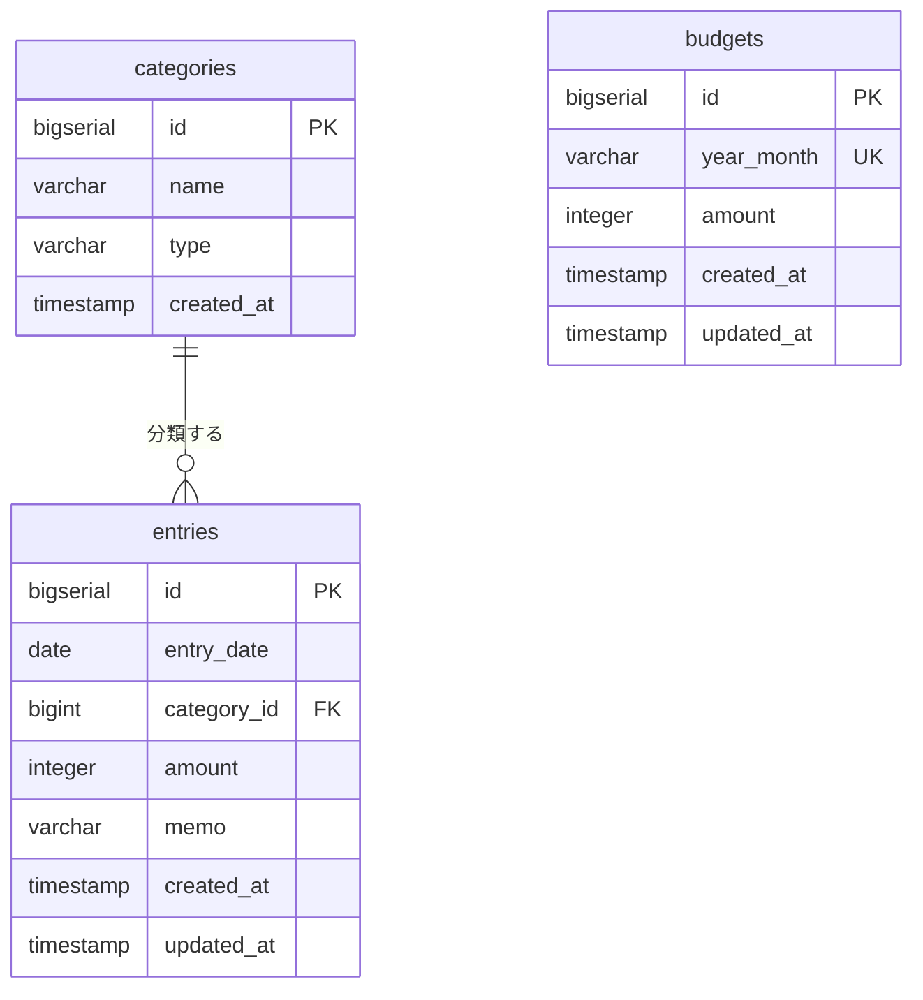

# データベース設計

DBMS は PostgreSQL（詳細なバージョンは [tech-stack.md](./tech-stack.md) 参照）。
認証なし・単一ユーザーのため、ユーザーを表すテーブルは持たない（[requirements.md](./requirements.md#22-対象外作らないもの) 参照）。

## ER 図



`budgets` は他のテーブルと関連を持たない。月（`year_month`）をキーに、集計時に `entries` と突き合わせる。

## テーブル定義

### categories（カテゴリ）

収支の分類。アプリ起動時に初期データを投入し、画面からの追加・編集は行わない。

| 列名 | 型 | NOT NULL | デフォルト | 説明 |
| --- | --- | --- | --- | --- |
| `id` | `BIGSERIAL` | ○ | 自動採番 | 主キー |
| `name` | `VARCHAR(50)` | ○ | - | カテゴリ名（例: 食費、給与） |
| `type` | `VARCHAR(10)` | ○ | - | 収支区分。`INCOME` または `EXPENSE` |
| `created_at` | `TIMESTAMP` | ○ | `CURRENT_TIMESTAMP` | 作成日時 |

制約:

| 種別 | 内容 |
| --- | --- |
| 主キー | `id` |
| 一意 | `(name, type)` — 同一区分内での名称重複を防ぐ |
| チェック | `type IN ('INCOME', 'EXPENSE')` |

> **実装時の注意**: `type` は ActiveRecord が単一テーブル継承（STI）用に予約している列名のため、モデル側で STI を無効化する設定が必要になる。回避できない場合は列名を `category_type` に変更し、本ドキュメントを更新する。

### entries（収支レコード）

1 件の収入または支出。アプリの主データ。

| 列名 | 型 | NOT NULL | デフォルト | 説明 |
| --- | --- | --- | --- | --- |
| `id` | `BIGSERIAL` | ○ | 自動採番 | 主キー |
| `entry_date` | `DATE` | ○ | - | 収支が発生した日。時刻は持たない |
| `category_id` | `BIGINT` | ○ | - | `categories.id` への外部キー |
| `amount` | `INTEGER` | ○ | - | 金額（円）。常に正の値で保持し、収入/支出は `categories.type` で判断する |
| `memo` | `VARCHAR(200)` | - | `NULL` | メモ。未入力可 |
| `created_at` | `TIMESTAMP` | ○ | `CURRENT_TIMESTAMP` | 作成日時 |
| `updated_at` | `TIMESTAMP` | ○ | `CURRENT_TIMESTAMP` | 更新日時。更新のたびに現在時刻で上書きする |

制約:

| 種別 | 内容 |
| --- | --- |
| 主キー | `id` |
| 外部キー | `category_id` → `categories(id)` `ON DELETE RESTRICT`（使用中カテゴリの削除を防ぐ） |
| チェック | `amount > 0 AND amount <= 9999999`（[features.md のバリデーション規則](./features.md#バリデーション規則)と一致させる） |

`amount` に `INTEGER` を使うのは、上限 9,999,999 が INTEGER の範囲に収まり、通貨計算で誤差の出る浮動小数点を避けるため。

**表示順を保持する列は持たない。** 一覧の並び順は `entry_date` 降順、同日なら `id` 降順に固定する。手動の並び替え機能を対象外としたため（[requirements.md の対象外](./requirements.md#22-対象外作らないもの)）。

### budgets（月次予算）

月ごとの支出上限額。1 か月につき 1 行。

| 列名 | 型 | NOT NULL | デフォルト | 説明 |
| --- | --- | --- | --- | --- |
| `id` | `BIGSERIAL` | ○ | 自動採番 | 主キー |
| `year_month` | `VARCHAR(7)` | ○ | - | 対象月。`2026-09` 形式 |
| `amount` | `INTEGER` | ○ | - | その月の予算額（円） |
| `created_at` | `TIMESTAMP` | ○ | `CURRENT_TIMESTAMP` | 作成日時 |
| `updated_at` | `TIMESTAMP` | ○ | `CURRENT_TIMESTAMP` | 更新日時 |

制約:

| 種別 | 内容 |
| --- | --- |
| 主キー | `id` |
| 一意 | `year_month` — **1 か月に予算が 2 つできることを DB レベルで防ぐ** |
| チェック | `amount >= 0 AND amount <= 99999999` |

#### `year_month` を文字列で持つ理由

`DATE` 型で「その月の1日」を入れる案もあるが、`VARCHAR(7)` を選んだ。

| 観点 | 判断 |
| --- | --- |
| 一意性の保証 | 文字列なら `2026-09` が一意になる。DATE だと「9月2日」のような不正な値も入りうる |
| API との対応 | API のパスが `/api/budgets/2026-09` なので、変換なしで扱える |
| 検索 | 月単位の取得が完全一致で済む（`WHERE year_month = '2026-09'`） |
| 並び替え | `2026-09` 形式は文字列としてソートしても時系列順になる（ゼロ埋め固定長のため） |

**予算が未設定の月は、行が存在しない。** 「予算 0 円」（行があって `amount = 0`）とは意味が異なる。前者は「まだ決めていない」、後者は「使わないと決めた」。[F-01](./features.md#f-01-月次サマリー) では前者を `null` として扱う。

## インデックス

| 名称 | 対象 | 目的 |
| --- | --- | --- |
| `index_entries_on_entry_date` | `entries(entry_date)` | 月別の絞り込みと期間検索（F-01, F-04, F-08） |
| `index_entries_on_category_id` | `entries(category_id)` | カテゴリ絞り込み（F-08）、カテゴリ別集計（F-03）、結合 |
| `index_budgets_on_year_month` | `budgets(year_month)` | 一意制約により自動的に作成される |

メモのキーワード検索（F-08）は部分一致（`ILIKE '%...%'`）のため通常のインデックスが効かない。要件の想定件数が 1,000 件程度（[non-functional.md の N-03](./non-functional.md#利用環境性能)）であり、全件走査で許容範囲と判断してインデックスは張らない。

## 月の絞り込み方法

月別の集計・一覧取得（F-01, F-03, F-04）では、`entry_date` が対象月に含まれる行を取得する。

```sql
WHERE entry_date >= '2026-09-01' AND entry_date < '2026-10-01'
```

`EXTRACT` や `TO_CHAR` で年月を取り出して比較する書き方（`WHERE TO_CHAR(entry_date, 'YYYY-MM') = '2026-09'`）は避ける。**列に関数を適用するとインデックスが使われなくなる**ため。範囲比較なら `index_entries_on_entry_date` が効く。

## 初期データ（categories のシード）

アプリ初回起動時に投入する。`(name, type)` の一意制約により、再実行しても重複しない形で流す。

### 支出（EXPENSE）

| id | name |
| --- | --- |
| 1 | 食費 |
| 2 | 日用品 |
| 3 | 交通費 |
| 4 | 住居費 |
| 5 | 水道光熱費 |
| 6 | 通信費 |
| 7 | 娯楽費 |
| 8 | 医療費 |
| 9 | その他 |

### 収入（INCOME）

| id | name |
| --- | --- |
| 10 | 給与 |
| 11 | 賞与 |
| 12 | 副収入 |
| 13 | その他収入 |

`id` は採番順の目安であり、アプリ側で値を前提にした処理は行わない。

## API との対応

| API | 主な DB 操作 |
| --- | --- |
| `GET /api/summary` | `entries` を対象月で絞り、`categories` と結合して `type` 別に合計。カテゴリ別は `GROUP BY category_id`。あわせて `budgets` を `year_month` で 1 行取得 |
| `GET /api/entries` | `entries` と `categories` を結合し、月・検索条件で絞り込んで `entry_date` 降順で取得 |
| `GET /api/categories` | `categories` を `type`, `id` 順で全件取得 |
| `POST /api/entries` | 1 行 INSERT |
| `PUT /api/entries/{id}` | 1 行 UPDATE（`updated_at` を更新） |
| `PATCH /api/entries/bulk` | 複数行を 1 トランザクションで UPDATE。1 件でも対象外 ID があれば全体をロールバック |
| `DELETE /api/entries/{id}` | 1 行 DELETE |
| `DELETE /api/entries/bulk` | 複数行を 1 トランザクションで DELETE。1 件でも対象外 ID があれば全体をロールバック |
| `PUT /api/budgets/{year_month}` | `year_month` で検索し、あれば UPDATE、なければ INSERT |
