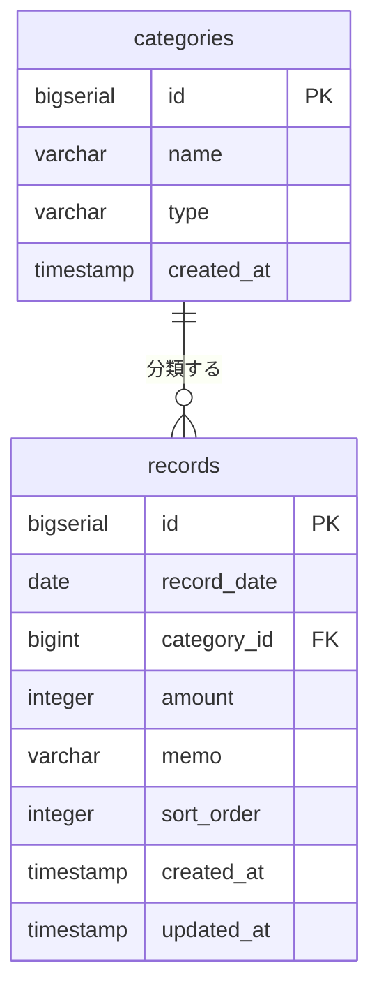

# データベース設計

DBMS は PostgreSQL（詳細なバージョンは手順3の `tech-stack.md` で確定）。
認証なし・単一ユーザーのため、ユーザーを表すテーブルは持たない（[requirements.md](./requirements.md#22-対象外作らないもの) 参照）。

## ER 図

## テーブル定義

### categories（カテゴリ）

収支の分類。アプリ起動時に初期データを投入し、画面からの追加・編集は行わない。

| 列名 | 型 | NOT NULL | デフォルト | 説明 |
| --- | --- | --- | --- | --- |
| `id` | `BIGSERIAL` | ○ | 自動採番 | 主キー |
| `name` | `VARCHAR(50)` | ○ | - | カテゴリ名（例: 食費、給与） |
| `type` | `VARCHAR(10)` | ○ | - | 収支区分。`INCOME` または `EXPENSE` |
| `created_at` | `TIMESTAMP` | ○ | `CURRENT_TIMESTAMP` | 作成日時 |

制約:

| 種別 | 内容 |
| --- | --- |
| 主キー | `id` |
| 一意 | `(name, type)` — 同一区分内での名称重複を防ぐ |
| チェック | `type IN ('INCOME', 'EXPENSE')` |

### records（収支レコード）

1 件の収入または支出。アプリの主データ。

| 列名 | 型 | NOT NULL | デフォルト | 説明 |
| --- | --- | --- | --- | --- |
| `id` | `BIGSERIAL` | ○ | 自動採番 | 主キー |
| `record_date` | `DATE` | ○ | - | 収支が発生した日。時刻は持たない |
| `category_id` | `BIGINT` | ○ | - | `categories.id` への外部キー |
| `amount` | `INTEGER` | ○ | - | 金額（円）。常に正の値で保持し、収入/支出は `categories.type` で判断する |
| `memo` | `VARCHAR(200)` | - | `NULL` | メモ。未入力可 |
| `sort_order` | `INTEGER` | ○ | - | 一覧の表示順。小さいほど上（[採番規則](#表示順-sort_order-の採番)） |
| `created_at` | `TIMESTAMP` | ○ | `CURRENT_TIMESTAMP` | 作成日時 |
| `updated_at` | `TIMESTAMP` | ○ | `CURRENT_TIMESTAMP` | 更新日時。更新のたびに現在時刻で上書きする |

制約:

| 種別 | 内容 |
| --- | --- |
| 主キー | `id` |
| 外部キー | `category_id` → `categories(id)` `ON DELETE RESTRICT`（使用中カテゴリの削除を防ぐ） |
| チェック | `amount > 0 AND amount <= 9999999`（[features.md のバリデーション規則](./features.md#バリデーション規則)と一致させる） |

`amount` に `INTEGER` を使うのは、上限 9,999,999 が INTEGER の範囲に収まり、通貨計算で誤差の出る浮動小数点を避けるため。

## インデックス

| 名称 | 対象 | 目的 |
| --- | --- | --- |
| `idx_records_record_date` | `records(record_date)` | 期間検索（F-03 の `from` / `to`） |
| `idx_records_category_id` | `records(category_id)` | カテゴリ絞り込み（F-03）と結合 |
| `idx_records_sort_order` | `records(sort_order)` | 一覧の既定の並び替え（F-01） |

メモのキーワード検索（F-03）は部分一致（`ILIKE '%...%'`）のため通常のインデックスが効かない。要件の想定件数が 1,000 件程度（[requirements.md の非機能要件](./requirements.md#5-非機能要件)）であり、全件走査で許容範囲と判断してインデックスは張らない。

## 表示順 sort_order の採番

一覧の既定の並び順は `sort_order` 昇順（同値なら `record_date` 降順、さらに `id` 降順）。

| 場面 | 採番方法 |
| --- | --- |
| レコード追加（F-04） | `COALESCE(MAX(sort_order), 0) + 100` を採番する。レコードが 0 件なら `100` |
| 並び替え（F-05） | 並び替え後の一覧を先頭から `100, 200, 300, ...` と振り直し、`PATCH /api/records/order` で 1 トランザクションにまとめて更新する |
| その他の更新（F-05 の内容更新、F-06 の一括更新） | `sort_order` は変更しない |

100 刻みにしておくのは、将来 1 行だけを間に挿入する実装に変えたくなったときに、間の値を使って全行の更新を避けられるようにするため。
並び替えは全件を対象とする操作のため、検索で絞り込んでいる間は無効化する（F-05 の受け入れ条件）。

## 初期データ（categories のシード）

アプリ初回起動時に投入する。`(name, type)` の一意制約により、再実行しても重複しない形で流す。

### 支出（EXPENSE）

| id | name |
| --- | --- |
| 1 | 食費 |
| 2 | 日用品 |
| 3 | 交通費 |
| 4 | 住居費 |
| 5 | 水道光熱費 |
| 6 | 通信費 |
| 7 | 娯楽費 |
| 8 | 医療費 |
| 9 | その他 |

### 収入（INCOME）

| id | name |
| --- | --- |
| 10 | 給与 |
| 11 | 賞与 |
| 12 | 副収入 |
| 13 | その他収入 |

`id` は採番順の目安であり、アプリ側で値を前提にした処理は行わない。

## API との対応

| API | 主な DB 操作 |
| --- | --- |
| `GET /api/records` | `records` と `categories` を結合し、条件で絞り込んで `sort_order` 昇順で取得 |
| `GET /api/categories` | `categories` を `type`, `id` 順で全件取得 |
| `POST /api/records` | `sort_order` を採番して 1 行 INSERT |
| `PUT /api/records/{id}` | 1 行 UPDATE（`sort_order` は据え置き、`updated_at` を更新） |
| `PATCH /api/records/bulk` | 複数行を 1 トランザクションで UPDATE。1 件でも対象外 ID があれば全体をロールバック |
| `PATCH /api/records/order` | `sort_order` を 1 トランザクションでまとめて UPDATE |
| `DELETE /api/records/{id}` | 1 行 DELETE |
