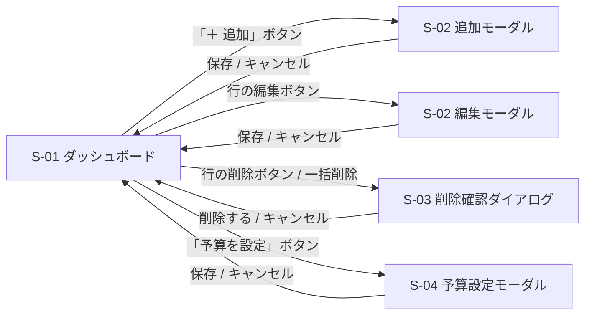

# 画面設計

[features.md](./features.md) の各機能を、画面の単位に整理したもの。
モックアップ: [mockups/index.html](./mockups/index.html) / [mockups/index-select-mode.html](./mockups/index-select-mode.html) / [mockups/entry-modal.html](./mockups/entry-modal.html) / [mockups/budget-modal.html](./mockups/budget-modal.html)

## 画面一覧

| 画面ID | 名称 | 役割 | 対応機能 |
| --- | --- | --- | --- |
| [S-01](#s-01-ダッシュボード) | ダッシュボード | アプリの起点。残額の把握と明細の管理 | F-01, F-03, F-04, F-08, F-09 |
| [S-02](#s-02-収支入力モーダル) | 収支入力モーダル | レコードの新規登録と編集 | F-05, F-06 |
| [S-03](#s-03-削除確認ダイアログ) | 削除確認ダイアログ | 削除前の確認 | F-07, F-09 |
| [S-04](#s-04-予算設定モーダル) | 予算設定モーダル | 対象月の予算を登録・変更 | F-02 |

本アプリは単一ページ構成で、S-02〜S-04 は S-01 の上に重ねて表示する。URL 遷移は行わない。

## 画面遷移



---

## S-01 ダッシュボード

### 画面の主役

**この画面で最も目立つべきは「残額」**である。ユーザーが最も頻繁に知りたいのは「あといくら使えるか」であり（[requirements.md](./requirements.md#1-背景と目的)）、明細の一覧はその根拠を示す補助的な情報として下部に置く。

### 表示モード

S-01 には 2 つのモードがある。

| モード | 状態 | 切り替え |
| --- | --- | --- |
| 通常モード | チェックボックスなし。行ごとの編集・削除ボタンあり | 初期状態 |
| 選択モード | チェックボックスあり。一括操作バーを表示。行ごとの編集・削除ボタンは非表示 | 「選択」ボタンで入り、「完了」ボタンで戻る |

使用頻度の低い一括操作（[F-09](./features.md#f-09-一括更新)）のために、通常時の画面を占有させないための設計。

### レイアウト（通常モード）

モックアップ: [mockups/index.html](./mockups/index.html)

```
┌──────────────────────────────────────────────────┐
│ 家計簿                                            │ ヘッダ
├──────────────────────────────────────────────────┤
│              ◀   2026年9月   ▶                    │ 月切替
├──────────────────────────────────────────────────┤
│  予算 80,000    使用 52,300      [予算を設定]     │
│  ████████████████░░░░░░░░  65%                   │ サマリー
│                                                   │ （主役）
│            残り  27,700 円                        │
├──────────────────────────────────────────────────┤
│  支出の内訳                                       │
│   食費      32,100  ████████████  61%            │ カテゴリ別
│   日用品     8,200  ███            16%            │ 集計
│   交通費     4,000  ██              8%            │
├──────────────────────────────────────────────────┤
│  [カテゴリ▼] [キーワード]  [検索] [クリア]        │ 検索バー
├──────────────────────────────────────────────────┤
│  明細  12件                    [＋ 追加] [選択]   │
│  09/25  食費      -1,280  スーパー         ✎ 🗑  │ 明細一覧
│  09/25  給与    +250,000  9月分            ✎ 🗑  │
│  09/24  交通費      -820  電車             ✎ 🗑  │
└──────────────────────────────────────────────────┘
```

### レイアウト（選択モード）

モックアップ: [mockups/index-select-mode.html](./mockups/index-select-mode.html)

```
┌──────────────────────────────────────────────────┐
│  （サマリー・内訳・検索バーは通常モードと同じ）    │
├──────────────────────────────────────────────────┤
│  2件選択中  [カテゴリ▼][日付][適用] [削除][完了] │ 一括操作バー
├──────────────────────────────────────────────────┤
│  ☐  日付   カテゴリ   金額      メモ              │
│  ☑ 09/25  食費      -1,280   スーパー            │
│  ☐ 09/25  給与    +250,000   9月分               │
│  ☑ 09/24  交通費      -820   電車                │
└──────────────────────────────────────────────────┘
```

### 構成要素

#### 月切替

| 要素 | 種別 | 挙動 | 対応機能 |
| --- | --- | --- | --- |
| 「◀」ボタン | ボタン | 対象月を前月に切り替え、サマリー・内訳・明細をすべて再取得 | F-04 |
| 対象月の表示 | 表示 | 「2026年9月」形式。初期値は当月 | F-04 |
| 「▶」ボタン | ボタン | 対象月を翌月に切り替え | F-04 |

#### サマリー領域（主役）

| 要素 | 種別 | 挙動 | 対応機能 |
| --- | --- | --- | --- |
| 予算額 | 表示 | 対象月の予算。未設定なら「未設定」と表示 | F-01, F-02 |
| 使用額 | 表示 | 対象月の支出合計 | F-01 |
| 進捗バー | 表示 | 使用率を視覚化。予算超過時は警告色。予算未設定時は非表示 | F-01 |
| **残額** | 表示 | **画面内で最も大きく表示する。** 予算 − 支出合計。マイナスなら警告色で「超過 ◯◯円」 | F-01 |
| 「予算を設定」ボタン | ボタン | [S-04](#s-04-予算設定モーダル) を開く | F-02 |

#### カテゴリ別集計

| 要素 | 種別 | 挙動 | 対応機能 |
| --- | --- | --- | --- |
| カテゴリ名 | 表示 | 支出カテゴリのみ。金額の降順 | F-03 |
| 金額 | 表示 | 3 桁区切り | F-03 |
| 割合バーと % | 表示 | 支出合計に占める割合を視覚化 | F-03 |
| 空表示 | 表示 | 支出が 0 件のとき「支出がありません」 | F-03 |

#### 検索バー

| 要素 | 種別 | 挙動 | 対応機能 |
| --- | --- | --- | --- |
| カテゴリ | セレクト | 検索条件。「すべて」を含む | F-08 |
| キーワード | テキスト入力 | メモの部分一致。大文字小文字を区別しない | F-08 |
| 期間 from / to | 日付入力 | 指定すると対象月を無視して横断検索 | F-08 |
| 「検索」ボタン | ボタン | 条件で明細一覧のみを再取得（サマリーと内訳は変わらない） | F-08 |
| 「クリア」ボタン | ボタン | 全条件をリセットし、対象月の全件表示に戻す | F-08 |

#### 明細一覧

| 要素 | 種別 | 挙動 | 対応機能 |
| --- | --- | --- | --- |
| 件数表示 | 表示 | 「明細 12件」。絞り込み中は「12件中 3件」 | F-04, F-08 |
| 「＋ 追加」ボタン | ボタン | [S-02](#s-02-収支入力モーダル) を空の状態で開く | F-05 |
| 「選択」ボタン | ボタン | 選択モードに切り替える | F-09 |
| 日付列 | 表示 | `MM/DD` 形式 | F-04 |
| カテゴリ列 | 表示 | カテゴリ名 | F-04 |
| 金額列 | 表示 | 3 桁区切り。支出は赤系で `-`、収入は緑系で `+` | F-04 |
| メモ列 | 表示 | 長い場合は省略表示 | F-04 |
| 行の編集ボタン（✎） | ボタン | その行の値を入れた [S-02](#s-02-収支入力モーダル) を開く。**選択モードでは非表示** | F-06 |
| 行の削除ボタン（🗑） | ボタン | 1 件分の [S-03](#s-03-削除確認ダイアログ) を開く。**選択モードでは非表示** | F-07 |
| 空表示 | 表示 | 0 件のとき「この月のデータがありません」／検索結果 0 件のとき「該当するデータがありません」 | F-04, F-08 |
| ローディング表示 | 表示 | API 通信中に表示 | F-04 |
| エラーバナー | 表示 | 通信失敗時に画面上部へ表示。閉じられる | F-04 |

#### 一括操作バー（選択モードのみ）

| 要素 | 種別 | 挙動 | 対応機能 |
| --- | --- | --- | --- |
| 選択件数 | 表示 | 「2件選択中」 | F-09 |
| ヘッダのチェックボックス | チェックボックス | 表示中の全行を選択／解除 | F-09 |
| 行のチェックボックス | チェックボックス | その行の選択／解除 | F-09 |
| 一括カテゴリ／一括日付 + 「適用」 | セレクト・日付入力・ボタン | 選択行のカテゴリまたは日付をまとめて更新 | F-09 |
| 「削除」ボタン | ボタン | 選択件数を伴う [S-03](#s-03-削除確認ダイアログ) を開く | F-09 |
| 「完了」ボタン | ボタン | 通常モードに戻り、選択をすべて解除 | F-09 |

---

## S-02 収支入力モーダル

### レイアウト

一覧の上に重ね、背後をオーバーレイで暗くする。追加と編集で同じモーダルを使い、タイトルと初期値だけを変える。
モックアップ: [mockups/entry-modal.html](./mockups/entry-modal.html)

```
┌───────────────────────────┐
│ 収支を追加            [×] │
├───────────────────────────┤
│ 日付   [2026-09-25      ] │
│ カテゴリ [食費         ▼] │
│ 金額   [           1280 ] │
│        金額は1以上の整数… │ ← エラー時のみ
│ メモ   [                ] │
├───────────────────────────┤
│         [キャンセル][保存] │
└───────────────────────────┘
```

### 構成要素

| 要素 | 種別 | 挙動 | 対応機能 |
| --- | --- | --- | --- |
| タイトル | 表示 | 追加時「収支を追加」／編集時「収支を編集」 | F-05, F-06 |
| 日付 | 日付入力（必須） | 追加時の初期値は、対象月が当月なら本日、それ以外ならその月の1日。編集時は既存値 | F-05, F-06 |
| カテゴリ | セレクト（必須） | 「支出」「収入」でグループ分けして表示 | F-05, F-06 |
| 金額 | 数値入力（必須） | 1 以上 9,999,999 以下の整数 | F-05, F-06 |
| メモ | テキスト入力（任意） | 200 文字以内 | F-05, F-06 |
| 項目ごとのエラー表示 | 表示 | 400 応答時、該当入力欄の下に赤字で表示 | F-05, F-06 |
| 「保存」ボタン | ボタン | 追加は `POST /api/entries`、編集は `PUT /api/entries/{id}`。成功でモーダルを閉じ、一覧とサマリーと内訳を更新 | F-05, F-06 |
| 「キャンセル」ボタン／「×」 | ボタン | 変更を破棄して閉じる | F-05, F-06 |

バリデーション規則の詳細は [features.md の共通仕様](./features.md#バリデーション規則) を参照。

---

## S-03 削除確認ダイアログ

### レイアウト

```
┌───────────────────────────┐
│ 削除の確認                │
│ 3件のデータを削除します。 │
│ この操作は取り消せません。│
│      [キャンセル][削除する]│
└───────────────────────────┘
```

### 構成要素

| 要素 | 種別 | 挙動 | 対応機能 |
| --- | --- | --- | --- |
| 件数メッセージ | 表示 | 単体削除は「このデータを削除します。」／一括削除は「N件のデータを削除します。」 | F-07, F-09 |
| 「削除する」ボタン | ボタン | 削除を実行し、閉じて一覧・サマリー・内訳を更新 | F-07, F-09 |
| 「キャンセル」ボタン | ボタン | 何もせず閉じる | F-07, F-09 |

---

## S-04 予算設定モーダル

### レイアウト

モックアップ: [mockups/budget-modal.html](./mockups/budget-modal.html)

```
┌───────────────────────────┐
│ 2026年9月の予算       [×] │
├───────────────────────────┤
│ 予算額  [          80000 ] │
│         予算は0以上の整数… │ ← エラー時のみ
│                            │
│ この月に使ってよい上限額を │
│ 設定します。               │
├───────────────────────────┤
│         [キャンセル][保存] │
└───────────────────────────┘
```

### 構成要素

| 要素 | 種別 | 挙動 | 対応機能 |
| --- | --- | --- | --- |
| タイトル | 表示 | 対象月を明示する（「2026年9月の予算」） | F-02 |
| 予算額 | 数値入力（必須） | 0 以上 99,999,999 以下の整数。未設定の月は空、設定済みなら現在値 | F-02 |
| 補足文 | 表示 | 何を設定しているかの説明 | F-02 |
| エラー表示 | 表示 | 400 応答時、入力欄の下に赤字で表示 | F-02 |
| 「保存」ボタン | ボタン | `PUT /api/budgets/{year_month}`。成功でモーダルを閉じ、サマリーを更新 | F-02 |
| 「キャンセル」ボタン／「×」 | ボタン | 変更を破棄して閉じる | F-02 |
