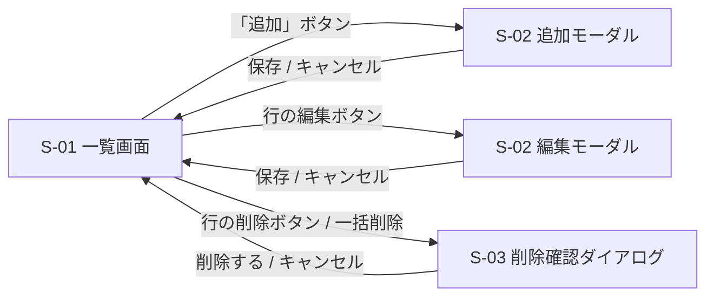

# 画面設計

[features.md](./features.md) の各機能を、画面の単位に整理したもの。
モックアップ: [mockups/index.html](./mockups/index.html) / [mockups/entry-modal.html](./mockups/entry-modal.html)

## 画面一覧

| 画面ID | 名称 | 役割 | 対応機能 |
| --- | --- | --- | --- |
| [S-01](#s-01-一覧画面) | 一覧画面 | アプリの起点。収支の一覧・検索・選択・並び替え | F-01, F-02, F-03, F-05, F-06, F-07 |
| [S-02](#s-02-追加編集モーダル) | 追加・編集モーダル | レコードの新規登録と編集 | F-04, F-05 |
| [S-03](#s-03-削除確認ダイアログ) | 削除確認ダイアログ | 削除前の確認 | F-07 |

本アプリは単一ページ構成で、S-02 と S-03 は S-01 の上に重ねて表示する。URL 遷移は行わない。

## 画面遷移



---

## S-01 一覧画面

### レイアウト

上から順に、ヘッダ → 集計バー → 検索バー → （選択時のみ）一括操作バー → 一覧テーブル、の縦積み。
モックアップ: [mockups/index.html](./mockups/index.html)

```
┌─────────────────────────────────────────────┐
│ 家計簿                          [ + 追加 ]   │ ヘッダ
├─────────────────────────────────────────────┤
│ 収入 250,000 / 支出 84,300 / 差額 165,700   │ 集計バー
├─────────────────────────────────────────────┤
│ [期間 from]〜[to] [カテゴリ▼] [キーワード]   │ 検索バー
│                       [検索] [クリア]        │
├─────────────────────────────────────────────┤
│ 3件選択中  [カテゴリ▼][日付][適用] [削除]    │ 一括操作バー（選択時のみ）
├─────────────────────────────────────────────┤
│ ⣿ ☐ 日付    カテゴリ  金額     メモ    操作  │ テーブルヘッダ
│ ⣿ ☐ 09/25  食費     -1,280  スーパー ✎ 🗑 │
│ ⣿ ☐ 09/25  給与    +250,000 9月分   ✎ 🗑 │
└─────────────────────────────────────────────┘
```

### 構成要素

| 要素 | 種別 | 挙動 | 対応機能 |
| --- | --- | --- | --- |
| 「＋ 追加」ボタン | ボタン | [S-02](#s-02-追加編集モーダル) を空の状態で開く | F-04 |
| 集計バー | 表示 | 表示中レコードの収入合計・支出合計・差額。検索や更新のたびに再計算 | F-02, F-03 |
| 期間 from / to | 日付入力 | 検索条件の開始日・終了日（両端を含む） | F-03 |
| カテゴリ | セレクト | 検索条件。「すべて」を含む | F-03 |
| キーワード | テキスト入力 | メモの部分一致。大文字小文字を区別しない | F-03 |
| 「検索」ボタン | ボタン | 入力条件で `GET /api/records` を再取得 | F-03 |
| 「クリア」ボタン | ボタン | 全条件をリセットし、全件表示に戻す | F-03 |
| 一括操作バー | 領域 | 1 件以上選択したときだけ表示。選択件数を表示 | F-06, F-07 |
| 一括カテゴリ／一括日付 + 「適用」 | セレクト・日付入力・ボタン | 選択行のカテゴリまたは日付をまとめて更新 | F-06 |
| 一括「削除」ボタン | ボタン | 選択件数を伴う [S-03](#s-03-削除確認ダイアログ) を開く | F-07 |
| ヘッダのチェックボックス | チェックボックス | 表示中の全行を選択／解除 | F-06 |
| 行のチェックボックス | チェックボックス | その行の選択／解除 | F-06, F-07 |
| ドラッグハンドル（⣿） | ドラッグ操作 | 行をドラッグして表示順を変更。検索で絞り込み中は非活性（理由をツールチップ表示） | F-05 |
| 日付列 | 表示 | `MM/DD` 形式 | F-02 |
| カテゴリ列 | 表示 | カテゴリ名 | F-02 |
| 金額列 | 表示 | 3 桁区切り。支出は赤系で `-`、収入は緑系で `+` を付ける | F-02 |
| メモ列 | 表示 | 長い場合は省略表示 | F-02 |
| 行の編集ボタン（✎） | ボタン | その行の値を入れた [S-02](#s-02-追加編集モーダル) を開く | F-05 |
| 行の削除ボタン（🗑） | ボタン | 1 件分の [S-03](#s-03-削除確認ダイアログ) を開く | F-07 |
| 空表示 | 表示 | 0 件のとき「データがありません」／検索結果 0 件のとき「該当するデータがありません」 | F-02, F-03 |
| ローディング表示 | 表示 | API 通信中に表示 | F-02 |
| エラーバナー | 表示 | 通信失敗時に画面上部へ表示。閉じられる | F-02 |

---

## S-02 追加編集モーダル

### レイアウト

一覧の上に重ね、背後をオーバーレイで暗くする。追加と編集で同じモーダルを使い、タイトルと初期値だけを変える。
モックアップ: [mockups/entry-modal.html](./mockups/entry-modal.html)

```
┌───────────────────────────┐
│ 収支を追加            [×] │
├───────────────────────────┤
│ 日付   [2026-09-25      ] │
│ カテゴリ [食費         ▼] │
│ 金額   [           1280 ] │
│        金額は1以上の整数… │ ← エラー時のみ
│ メモ   [                ] │
├───────────────────────────┤
│         [キャンセル][保存] │
└───────────────────────────┘
```

### 構成要素

| 要素 | 種別 | 挙動 | 対応機能 |
| --- | --- | --- | --- |
| タイトル | 表示 | 追加時「収支を追加」／編集時「収支を編集」 | F-04, F-05 |
| 日付 | 日付入力（必須） | 追加時の初期値は本日。編集時は既存値 | F-04, F-05 |
| カテゴリ | セレクト（必須） | 「支出」「収入」でグループ分けして表示 | F-04, F-05 |
| 金額 | 数値入力（必須） | 1 以上 9,999,999 以下の整数 | F-04, F-05 |
| メモ | テキスト入力（任意） | 200 文字以内 | F-04, F-05 |
| 項目ごとのエラー表示 | 表示 | 400 応答時、該当入力欄の下に赤字で表示 | F-04, F-05 |
| 「保存」ボタン | ボタン | 追加は `POST /api/records`、編集は `PUT /api/records/{id}`。成功でモーダルを閉じ一覧を更新 | F-04, F-05 |
| 「キャンセル」ボタン／「×」 | ボタン | 変更を破棄して閉じる | F-04, F-05 |

バリデーション規則の詳細は [features.md の共通仕様](./features.md#バリデーション規則) を参照。

---

## S-03 削除確認ダイアログ

### レイアウト

```
┌───────────────────────────┐
│ 削除の確認                │
│ 3件のデータを削除します。 │
│ この操作は取り消せません。│
│      [キャンセル][削除する]│
└───────────────────────────┘
```

### 構成要素

| 要素 | 種別 | 挙動 | 対応機能 |
| --- | --- | --- | --- |
| 件数メッセージ | 表示 | 単体削除は「このデータを削除します。」／一括削除は「N件のデータを削除します。」 | F-07 |
| 「削除する」ボタン | ボタン | `DELETE /api/records/{id}` を実行し、閉じて一覧を更新 | F-07 |
| 「キャンセル」ボタン | ボタン | 何もせず閉じる | F-07 |
