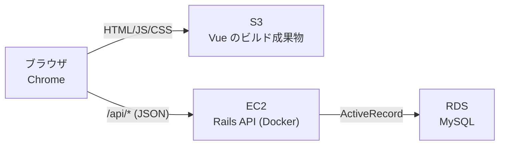

# 技術選定

[requirements.md](./requirements.md) の要件を満たすための技術構成と、その選定理由。
バージョンは着手時点での安定版を基準とし、実際の値は初期化時（[plan.md](./plan.md) のフェーズ1）に `Gemfile` / `package.json` で確定させる。

## 全体構成



フロントエンドとバックエンドを分離した構成とする。画面は S3 から静的配信し、データ操作は EC2 上の Rails API を経由して RDS に永続化する。

## 採用技術一覧

| 層 | 技術 | バージョン方針 |
| --- | --- | --- |
| バックエンド言語 | Ruby | 3.3 系 |
| バックエンドFW | Ruby on Rails（APIモード） | 8.1 系 |
| DBアクセス | ActiveRecord | Rails 同梱 |
| DBマイグレーション | ActiveRecord Migration | Rails 同梱 |
| APIレスポンス整形 | Jbuilder | 最新安定版 |
| CORS | rack-cors | 最新安定版 |
| テスト | RSpec Rails + FactoryBot | 最新安定版 |
| データベース | MySQL | 8.4（LTS） |
| フロントエンド言語 | TypeScript | 6.x 系 |
| フロントエンドFW | Vue | 3 系（Composition API） |
| ビルドツール | Vite | 最新安定版 |
| HTTPクライアント | fetch（標準API） | - |
| ローカル実行 | Docker Compose | - |
| Lint（Ruby） | RuboCop（`rubocop-rails-omakase`） | Rails 同梱 |
| 静的セキュリティ解析 | Brakeman | Rails 同梱 |
| 脆弱性チェック（Ruby） | bundler-audit | Rails 同梱 |
| Lint（フロント） | ESLint + Prettier、型チェックは vue-tsc | 最新安定版 |
| 脆弱性チェック（フロント） | `npm audit` | npm 同梱 |
| CI | GitHub Actions | Rails 生成のワークフローを拡張 |
| インフラ | Terraform + AWS（EC2 / RDS / S3） | Terraform 1.x 系 |

## 選定理由

### バックエンド: Ruby on Rails（APIモード）

本課題の目的のひとつが **これまで扱っていない言語を習得すること** であるため、Ruby を選んだ。Java のような静的型付け・明示的な記述とは対照的に、Ruby は動的型付けで記述量が少なく、Rails は「設定より規約」の思想を徹底している。設計の考え方そのものが異なるため、言語を変える意義が大きい。

Rails を選ぶ実務上の理由:

- ルーティング、バリデーション、DBアクセス、マイグレーション、テストが**フレームワークに最初から揃っている**。ライブラリの寄せ集めにならず、[features.md](./features.md) の 9 本の API を短い記述で実装できる
- `rescue_from` により、[エラーレスポンス](./features.md#エラーレスポンス)（400 / 404 / 500）の形式を 1 箇所で共通化できる
- マイグレーションが標準機能のため、[database.md](./database.md) のテーブル定義をバージョン管理でき、ローカルと RDS に同じ手順でスキーマを適用できる

**APIモード**（`rails new --api`）を選ぶのは、画面を Vue が持つため、ビューまわりの機能を読み込む必要がないから。起動が軽くなり、ミドルウェアの構成も理解しやすい。

#### 生成時のオプション

`rails new` は、使わない構成要素まで一式生成する。生成の時点で外しておく。

```
rails new backend --api --database=mysql \
  --skip-test --skip-kamal --skip-solid --skip-thruster \
  --skip-action-mailer --skip-action-mailbox --skip-action-text \
  --skip-active-storage --skip-action-cable
```

| オプション | 外す理由 |
| --- | --- |
| `--skip-test` | minitest を生成しない。テストは RSpec を使う（後述） |
| `--skip-kamal` / `--skip-thruster` | デプロイは [plan.md](./plan.md#フェーズ6-aws) の `deploy.sh` による手動手順とする |
| `--skip-solid` | Solid Queue / Cache / Cable。非同期ジョブもキャッシュも使わない |
| `--skip-action-mailer` / `--skip-action-mailbox` | メールの送受信をしない |
| `--skip-action-text` | リッチテキストを扱わない |
| `--skip-active-storage` | ファイル添付をしない（[requirements.md の対象外](./requirements.md#22-対象外作らないもの)で画像添付を外している）。あわせて `image_processing` gem も入らなくなる |
| `--skip-action-cable` | WebSocket を使わない |

**Dockerfile は残す。** 本番の EC2 上で Rails をコンテナとして動かすため（[インフラ](#インフラ-terraform--ec2--rds--s3)）。

ただし**生成される Dockerfile は本番専用**で、`RAILS_ENV=production`・`BUNDLE_WITHOUT=development` が固定され、アプリのコードをイメージに焼き込む作りになっている。この構成では RSpec も RuboCop も実行できず、ソースをバインドマウントする開発にも使えない。そのため**ローカル用に `backend/Dockerfile.dev` を別に置き**、compose の `api` はそちらをビルドする。生成物の Dockerfile は書き換えず、デプロイ時にそのまま使う。

**`--skip-ci` は付けない。** 生成される `.github/workflows/ci.yml` をそのまま土台として使う（後述の [CI](#ci-github-actions)）。

#### 生成物からそのまま使うもの

`rails new` は品質まわりのツールを既定で Gemfile に入れる。自分で追加する必要はなく、**そのまま採用する**。

| 同梱されるもの | 使い道 |
| --- | --- |
| `rubocop-rails-omakase` | Rails 公式の RuboCop 設定。`.rubocop.yml` も生成される（[N-34](./non-functional.md#開発プロセス品質)） |
| `brakeman` | Rails 向けの静的セキュリティ解析。`bin/brakeman` が用意される |
| `bundler-audit` | gem の既知脆弱性の検出。`bin/bundler-audit` が用意される（[N-35](./non-functional.md#開発プロセス品質)） |
| `.github/workflows/ci.yml` | brakeman / bundler-audit / RuboCop を PR で実行するワークフロー |
| `.github/dependabot.yml` | 依存更新の PR を自動で作る設定 |

#### 自分で追加するもの

**Jbuilder は API モードの Gemfile で無効になっている**（`# gem "jbuilder"` とコメントアウトされた状態で生成される）。使うにはコメントを外して明示的に有効化する。Hash を `render json:` で返すこともできるが、[features.md](./features.md) の月次サマリー（予算・合計・カテゴリ別内訳を 1 レスポンスにまとめる）のような入れ子構造は、テンプレートとして書いたほうが見通しが良い。

このほか `rack-cors`、`rspec-rails`、`factory_bot_rails` を追加する。

> 上記は Rails 8.1.4 / Ruby 3.3 のコンテナで `rails new --help` と実際の生成物を確認した結果にもとづく。

### DBアクセス: ActiveRecord

Rails 標準であり、他の選択肢を積極的に採る理由がない。今回の要件との相性も良い。

**一括更新（[F-09](./features.md#f-09-一括更新)）が 1 文の UPDATE で書ける:**

```ruby
Entry.where(id: ids).update_all(category_id: category_id, updated_at: Time.current)
```

この更新を `transaction` で囲めば、「1 件でも対象外 ID があれば全件更新しない」という F-09 の受け入れ条件も素直に満たせる。

**月次の集計（[F-01](./features.md#f-01-月次サマリー), [F-03](./features.md#f-03-カテゴリ別集計)）** も、集計メソッドで短く書ける:

```ruby
Entry.joins(:category)
     .where(entry_date: range)
     .where(categories: { category_type: "EXPENSE" })
     .group(:category_id)
     .sum(:amount)
```

**動的な検索条件（[F-08](./features.md#f-08-検索絞り込み)）** も、スコープをつなぐだけで書ける:

```ruby
scope = Entry.includes(:category)
scope = scope.where(entry_date: from..) if from.present?
scope = scope.where(entry_date: ..to)   if to.present?
scope = scope.where(category_id:)       if category_id.present?
scope = scope.where("memo LIKE ?", "%#{keyword}%") if keyword.present?
```

条件の有無で WHERE 句が変わる処理を、条件分岐をそのまま並べる形で表現できる。生成される SQL もプレースホルダ経由となり、[N-09](./non-functional.md#セキュリティ)（SQL 文字列に値を直接連結しない）を満たす。キーワード検索の `LIKE` も、上記のとおり `?` のプレースホルダを使い、文字列結合では組み立てない。

#### 一括更新・一括削除で自分が担保すること

`update_all` は速い代わりに、**モデルのバリデーションと `updated_at` の自動更新をどちらもスキップする**。つまり [F-09](./features.md#f-09-一括更新) で満たすべき条件のうち、Rails が面倒を見てくれるものは 1 つもない。一括更新の処理は、次の順で自分で組み立てる。

```ruby
# 1. ids が空でないこと、category_id と entry_date の少なくとも一方が
#    指定されていること → 満たさなければ 400
# 2. 件数の上限チェック（non-functional.md の N-29: 500 件まで）→ 超過は 400
# 3. 更新値そのものの妥当性
#    - entry_date: yyyy-MM-dd 形式の実在する日付か → 不正なら 400
#    - category_id: categories に存在するか → しなければ 400
# 4. 対象 ID がすべて存在するか → 1 件でも欠ければ 404。何も更新しない
# 5. 変更先カテゴリの category_type と、対象 entries の現在の category_type が
#    すべて一致するか → 不一致なら 400（features.md の「収支区分の変更について」）
# 6. transaction で囲んで update_all（updated_at を明示指定）
```

ここで重要なのは **3 と 5 の検証が単体編集（[F-06](./features.md#f-06-収支の編集)）と一括更新（F-09）で書き方が変わる**こと。単体編集なら日付の形式も収支区分の一致も `Entry` のモデルバリデーションとして書けるが、一括更新は `update_all` がそれを通らないため、**コントローラ側で事前に検証しなければ素通りする**。仕様上は同じルールなのに実装箇所が 2 つに分かれるので、両方にリクエストスペックを書く（[plan.md フェーズ3 の完了条件](./plan.md#フェーズ3-api)）。

**一括削除は `delete_all` を 1 文で使う**（`destroy_all` は対象の件数ぶん DELETE を発行する）。`entries` は他のテーブルから参照されておらず、削除時に連鎖させる関連もないため、コールバックを通す必要がない。1 回の DELETE で完結することが、[N-06](./non-functional.md#信頼性可用性) の「部分的に削除された状態を残さない」に直結する。

### データベース: MySQL 8.4

今回のデータは 3 テーブル・数千行規模で、必要なのは主キー・外部キー・一意制約・チェック制約と、日付範囲での絞り込みと `GROUP BY` の集計だけ。**どの RDBMS でも満たせる要件**であるため、機能差ではなく次の観点で選んだ。

- **日本語の情報量が最も多い。** Ruby と Vue を同時に学ぶため、DB まわりで調べ物に時間を取られない方がよい（Vue を選んだのと同じ判断基準）
- **RDS で標準的に使える。** 8.4 は LTS（長期サポート）版で、ローカルの Docker イメージと RDS の両方に同じメジャーバージョンが揃う（[N-37](./non-functional.md#開発プロセス品質)）
- 実務での採用例が多く、学習した内容を次に活かしやすい

**メモのキーワード検索（F-08）で照合順序がそのまま効く。** MySQL の既定の照合順序（`utf8mb4_0900_ai_ci` の `ci` = case-insensitive）は大文字小文字を区別しないため、`LIKE '%...%'` を書くだけで [F-08](./features.md#f-08-検索絞り込み) の「大文字小文字を区別しない部分一致」を満たせる。PostgreSQL の `ILIKE` のような専用の演算子を使わずに済み、生 SQL の断片が減る。

文字コードは **`utf8mb4`**、照合順序は **`utf8mb4_0900_ai_ci`** で作成する。`utf8mb4` を使うのは、MySQL の `utf8` が 3 バイトまでしか扱えず**絵文字や一部の漢字が保存できない**ため。ローカルのコンテナと RDS の両方で明示的に指定し、日本語のメモ・カテゴリ名が化けないようにする（[N-15](./non-functional.md#入力と表現)）。Rails と JSON レスポンスは既定で UTF-8 のため、追加の設定は不要。

接続には `mysql2` gem を使う（`rails new --database=mysql` で Gemfile に入る）。

### フロントエンド: Vue 3 + TypeScript + Vite

React を避けつつ SPA を作る前提での選択。

- **日本語の情報が最も豊富**で、公式ドキュメントも日本語化されている。新しい言語（Ruby）と同時に学ぶ以上、フロント側で調べ物に時間を取られにくい方がよい
- コンポーネント・props・状態という**概念は React と共通**のため、これまでの経験が無駄にならない。一方でテンプレート構文やリアクティビティの仕組みは異なり、新しく学ぶ部分もある
- TypeScript により、[features.md のレコードJSON表現](./features.md#レコードの-json-表現)を型として定義し、API レスポンスの扱いミスを防ぐ
- Vite はビルド成果物が静的ファイルのため、そのまま S3 へ配置できる

状態管理ライブラリ（Pinia 等）は入れない。画面が 1 つで、共有する状態が「一覧・検索条件・選択中ID・モーダルの開閉」に限られるため、Composition API の `ref` / `computed` で足りる。

**モーダルは HTML 標準の `<dialog>` を使う**（`showModal()` で開く）。[N-21](./non-functional.md#使い勝手) が求める「Esc キーで閉じる」「開いている間は背景にフォーカスが移らない」がブラウザ側の実装として最初から備わっており、初期フォーカスも `autofocus` 属性で取れる。自前でキーイベントとフォーカストラップを書くより記述が減り、[non-functional.md の対象外の表](./non-functional.md#対象外とする非機能要件)に書いた「ラベルとフォーカス可能な要素は素直な HTML で書く」という方針とも一致する。対応ブラウザは Chrome のみ（[N-01](./non-functional.md#利用環境性能)）なので互換性の考慮も不要。

金額の 3 桁区切り（[N-24](./non-functional.md#使い勝手)）は `Intl.NumberFormat` で行い、自前の桁区切り処理は書かない。

### 構成: API 分離型（Rails API + Vue の SPA）

Rails には Hotwire を使ったフルスタック構成もあるが、**手順2で作成した設計（JSON API・S3 静的配信・画面構成）をそのまま流用できる**ことを優先して、API 分離型を選んだ。設計の考え方を維持したまま、実装技術だけを入れ替える形になる。

### HTTPクライアント: 標準の fetch

使う API は 9 本だけで、axios のインターセプタ等の機能を必要としない。API 呼び出しは `src/api/` に薄いラッパ関数としてまとめ、エラーレスポンスの解釈をそこに集約する。

ただし `fetch` は **既定でタイムアウトを持たない**。サーバが応答を返さない場合、Promise は解決も棄却もされないままになり、画面はローディング表示のまま止まる。[N-26](./non-functional.md#使い勝手) の「無限ローディングにしない」を満たすため、ラッパ関数で `AbortSignal.timeout()` を渡し、一定時間で打ち切ってエラーバナーに倒す。

```ts
const res = await fetch(url, { ...init, signal: AbortSignal.timeout(10_000) })
```

ラッパ関数が引き受ける責務は次の 3 つ。これがあるため axios を入れずに済む。

- タイムアウトの付与（N-26）
- エラーレスポンス（[400 / 404 / 500](./features.md#エラーレスポンス)）の解釈。項目エラーは `errors` を呼び出し元に返し、それ以外はバナー用のメッセージに変換する
- JSON のパースと型付け

### テスト: RSpec + FactoryBot（リクエストスペック）

- Rails 標準は minitest だが、**実務では RSpec の採用率が高い**ため、学習の機会として RSpec を選ぶ
- `describe` / `context` / `it` の構造が、[features.md](./features.md) の受け入れ条件の書き方とそのまま対応する。受け入れ条件を 1 つずつ `it` に落とせる
- テスト対象は **API のリクエストスペック**とする。HTTP リクエストを投げてレスポンスと DB の状態を検証する形で、F-01〜F-09 の受け入れ条件を端から端まで確認できる
- フロントエンドは手動確認とする。新しい技術が多いため、テストの範囲を広げるより実装の完走を優先する

### コード品質: RuboCop / Brakeman / ESLint / Prettier

[N-34](./non-functional.md#開発プロセス品質) と [N-35](./non-functional.md#開発プロセス品質) に対応する。**Ruby 側は `rails new` の生成物をそのまま使い、追加導入はしない。** フロント側だけ自分で用意する。

| ツール | 対象 | 役割 | 入手 |
| --- | --- | --- | --- |
| RuboCop（`rubocop-rails-omakase`） | Ruby | 書式と記法の統一 | Rails 同梱 |
| Brakeman | Ruby | 静的セキュリティ解析 | Rails 同梱 |
| bundler-audit | Gemfile.lock | 既知の脆弱性を持つ gem の検出 | Rails 同梱 |
| ESLint | TypeScript / Vue | バグになりやすい記述の検出 | 追加 |
| Prettier | TypeScript / Vue / CSS | 書式の統一。整形は Prettier、検出は ESLint と役割を分ける | 追加 |
| vue-tsc | Vue SFC | `<script setup>` を含めた型チェック（`vue-tsc --noEmit`） | 追加 |
| `npm audit` | package-lock.json | フロント依存の脆弱性検出 | npm 同梱 |

Ruby を初めて書くため、規約を人間が覚える前に RuboCop に指摘させる。`rubocop-rails-omakase` は Rails 公式が定めた設定で、**そのまま使う**ことを前提にしている。実際に不都合が出た規則だけ `.rubocop.yml` で上書きする（最初から大量に除外設定を書かない）。

**Brakeman を採用する理由**は、本アプリが認証を持たない（[requirements.md](./requirements.md#22-対象外作らないもの)）ことにある。SQL インジェクションや安全でないリダイレクトを静的に検出できるため、[N-09](./non-functional.md#セキュリティ)（SQL 文字列に値を直接連結しない）を人間のコードレビューだけに頼らずに確認できる。同梱されており導入コストが無い。

### CI: GitHub Actions

[N-33](./non-functional.md#開発プロセス品質) で「main への直接 push をしない」と定めているが、ブランチ保護は「PR を経由すること」しか強制しない。**テストが緑であることを強制するには、PR 契機で自動実行される仕組みが要る**。[N-16](./non-functional.md#保守性運用)（`bundle exec rspec` が全緑）と N-34・N-35 も、ローカルでの実行を自己申告するだけでは担保にならない。

**ワークフローはゼロから書かない。** `rails new`（`--skip-ci` を付けない）が `.github/workflows/ci.yml` を生成し、そこには既に「PR と main への push を契機に、Brakeman・bundler-audit・RuboCop を実行する」ジョブが入っている。これを土台に、足りないジョブだけ足す。

| ジョブ | 実行内容 | 出所 |
| --- | --- | --- |
| `scan_ruby` | `bin/brakeman` / `bin/bundler-audit` | 生成物のまま |
| `lint` | `bin/rubocop` | 生成物のまま |
| `test` | `bundle exec rspec` | **追加**（`--skip-test` により生成されないため） |
| `frontend` | ESLint / `prettier --check` / `vue-tsc --noEmit` / `npm audit` | **追加** |

`test` ジョブの MySQL 8.4 は Actions の `services:` で起動する。**ローカルの `docker-compose.yml` とは別の定義になる**点に注意する（同じイメージ・同じメジャーバージョンを指定して [N-37](./non-functional.md#開発プロセス品質) の環境差異を避ける）。

4 つのジョブすべてを main のブランチ保護の**必須チェック**に指定することで、N-33 が仕組みとして成立する。

**自動デプロイ（CD）は行わない。** デプロイは [plan.md のフェーズ6](./plan.md#フェーズ6-aws) の `deploy.sh` による手動手順とする。自動化するには GitHub と AWS の OIDC 連携などの設定が増え、デプロイ先が単一 EC2 で、ダウンタイムも許容している（[N-38](./non-functional.md#デプロイバックアップ)）構成では見合わない。

### ローカル実行: Docker Compose

MySQL をコンテナで起動し、ローカルに DB を直接インストールせずに開発できる。起動手順は手順7で `start-servers` スキルとしてまとめる。

### インフラ: Terraform + EC2 / RDS / S3

| リソース | 用途 |
| --- | --- |
| S3（フロント用） | `vite build` の成果物を静的ウェブサイトとして配信 |
| S3（tfstate用） | Terraform の state 保管。他リソースより先に bootstrap として作る |
| EC2 | Rails API を Docker で実行。パブリックサブネットに配置。Elastic IP で IP を固定する（再起動で変わると、フロントに埋め込む `VITE_API_BASE_URL` が無効になる） |
| RDS（MySQL） | データ永続化。プライベートサブネットに配置し、EC2 のセキュリティグループからのみ接続を許可 |

課題の指定。構成をコード化することで、`terraform destroy` による確実な後片付けができる（[non-functional.md の N-17](./non-functional.md#保守性運用)）。
ECS や ALB は使わない。常時稼働・冗長化が要件外のため、単一 EC2 + Docker が最小構成として妥当。

#### 非機能要件から決まる設定

リソースを並べるだけでは満たせない要件があるため、Terraform に書く内容として明示しておく。

**接続元の制限は、API と画面の両方に必要（[N-08](./non-functional.md#セキュリティ)）**

認証を持たない代わりに接続元 IP で守る方針だが、**EC2 のセキュリティグループが守るのは API だけ**で、S3 から配信する画面には効かない。S3 の静的ウェブサイトホスティングはバケットをパブリックにする必要があるため、放置すると画面の URL を知った第三者が開ける状態になる。フロント配信用バケットのバケットポリシーに `aws:SourceIp` の条件を付け、**セキュリティグループと同じ IP に絞る**。[proposal.md](./proposal.md) で顧客に説明している「接続元を限定する」は、この 2 つが揃って初めて成立する。

**S3 の静的ウェブサイトは HTTP のみ**

S3 のウェブサイトエンドポイントは HTTPS に対応しない。HTTPS 化するには CloudFront か ALB を前段に置き、ACM で証明書を発行することになる。[HTTPS を対象外とした判断](./non-functional.md#対象外とする非機能要件)は、この構成上の制約と表裏一体になっている。

**キャッシュの出し分け（[N-39](./non-functional.md#デプロイバックアップ)）**

Vite のビルド成果物は既定でファイル名にハッシュが付くため、JS / CSS は長期キャッシュで問題ない。一方 `index.html` はファイル名が変わらないので、キャッシュされると更新が反映されない。**ファイル名にハッシュが付くかどうかで `Cache-Control` を出し分ける**必要があり、これは S3 側のメタデータとして `deploy.sh` の `aws s3 sync` で指定する（`--cache-control` を 2 回に分けて同期する）。

**EC2 のメモリ（[N-20](./non-functional.md#保守性運用) との兼ね合い）**

無料枠に収めるとインスタンスはメモリ 1GB 程度になる。**この上で Rails の Docker イメージをビルドするとメモリ不足で失敗しやすい**。スワップ領域を確保してからビルドする方針とし、EC2 の初期化スクリプトに含める。（ビルド済みイメージを ECR 経由で持ち込む案もあるが、リソースが 1 つ増えるため採らない。）

**RDS の自動バックアップ（[N-40](./non-functional.md#デプロイバックアップ)）**

`backup_retention_period` を明示的に指定して自動バックアップを有効にする。保持期間は既定値（1 日）のままとし、リストアの検証は行わない。

無料プランのアカウントでは、保持期間に 1 日より大きい値を指定すると `FreeTierRestrictionError` で拒否される。**保持期間を延ばす選択肢は、アカウントの種類に依存するため取らない。**

`destroy` の時点で保持期間内の自動スナップショットが残っていると、DB 本体を削除したあとも保持期間が過ぎるまで残る。自動スナップショットは手動では削除できないため、保持期間の経過を待つ（[N-20](./non-functional.md#保守性運用) の費用は、20GB を 1 日保持する分のみ）。

**tfstate のロック**

Terraform 1.10 以降は S3 backend の `use_lockfile = true` でロックファイルによる排他制御ができ、従来必要だった DynamoDB テーブルが不要になった。単一の開発者だが、管理するリソースを増やさずにロックが効くため採用する。

## 採用しなかった選択肢

| 選択肢 | 不採用の理由 |
| --- | --- |
| Java + Spring Boot | 既習のため、新しい言語を学ぶという今回の目的に合わない |
| React | 同上 |
| Rails + Hotwire | Rails 公式の正攻法だが、JSON API を作らない構成のため、手順2で作成した features.md の API 仕様を丸ごと書き直すことになる。また複数選択（F-09）のクライアント状態管理を Stimulus で手書きすることになる |
| Inertia.js + Vue | API を作らずに Vue を使える中間案だが、日本語の情報が少なく、Ruby と Vue を同時に学ぶ今回は調べ物の負担が大きい |
| Svelte | 記述量は最小だが、日本語の情報が Vue より明らかに少ない |
| Sinatra | Ruby 言語自体に集中できるが、マイグレーション・バリデーション・テスト基盤を自分で用意することになり、AWS まで含む本課題では負担が大きい |
| PostgreSQL | 当初はこちらを選定していた。要件を満たす点は MySQL と変わらないが、日本語の情報量と実務での採用例を重視して MySQL 8.4 に変更した。`ILIKE` のような独自演算子に頼らずに済む点も、[F-08](./features.md#f-08-検索絞り込み) の大文字小文字を区別しない検索を照合順序だけで満たせる MySQL の方が単純だった |
| minitest | Rails 標準だが、実務での露出は RSpec より少ない |
| vuedraggable / SortableJS | 当初はドラッグ&ドロップによる並び替えのために採用予定だったが、機能そのものを対象外としたため不要になった（[requirements.md の対象外](./requirements.md#22-対象外作らないもの)） |
| グラフ描画ライブラリ（Chart.js など） | カテゴリ別の内訳は、金額・割合・横棒バーを CSS で表現すれば把握できる。ライブラリの習得コストに見合わない |
| Pinia（状態管理） | 共有すべき状態が少なく、導入コストに見合わない |
| axios | fetch で足りる範囲しか使わない |
| ECS / Fargate + ALB | 学習用途の単一環境に対して構成要素が多く、コストも上がる |
| Kamal（Rails 8 標準のデプロイツール） | 複数ホストへのゼロダウンタイムデプロイを前提にした作りで、単一 EC2・ダウンタイム許容（[N-38](./non-functional.md#デプロイバックアップ)）の構成には機能が過剰。`deploy.sh` で足りる |
| Solid Queue / Solid Cache / Solid Cable | 非同期ジョブ・キャッシュ・WebSocket をいずれも使わない |
| Action Mailer / Mailbox / Text、Active Storage | メール送受信・リッチテキスト・ファイル添付をいずれも使わない（画像添付は[対象外](./requirements.md#22-対象外作らないもの)） |
| rubocop-rails / rubocop-rspec の個別導入 | Rails 同梱の `rubocop-rails-omakase` が Rails 公式の設定一式を提供するため、重ねて入れない |
| GitHub Actions による自動デプロイ（CD） | AWS との OIDC 連携などの設定が増える一方、デプロイ先は単一 EC2 で手動手順で足りる。CI（テストと lint）のみ採用する |
| DynamoDB（tfstate のロック用） | Terraform 1.10 以降の S3 ネイティブロックで代替できる |
| ECR | EC2 上でイメージをビルドすれば足り、リポジトリを 1 つ増やす必要がない |

## 命名の方針

**収支レコードのモデル名は `Entry`（テーブル名 `entries`）とする。** Rails では `record` が「DB の 1 行」を指す一般名詞として多用される（`ActiveRecord::RecordNotFound`、カスタムバリデータの `record` 引数など）ため、自作モデルを `Record` にすると自分のモデルの話か Rails の用語かの区別がつきにくく、エラー調査時にも検索しづらい。
日本語のドキュメント上の用語は「収支レコード」のまま維持する（[requirements.md の用語定義](./requirements.md#3-用語定義)）。

**カテゴリの収支区分を表す列名は `category_type` とする。** `type` は ActiveRecord が単一テーブル継承（STI）用に予約している列名で、そのまま使うとモデル側で STI を無効化する設定が要る。[features.md](./features.md#レコードの-json-表現) の JSON キーが既に `category_type` であることから、列名をそちらに合わせれば、規約に逆らう設定も JSON キーの変換処理も不要になる（[database.md](./database.md#categoriesカテゴリ)）。

**API の JSON キーは snake_case** とする（`entry_date`、`category_id`、`year_month`）。Rails の属性名がそのまま JSON キーになるため、キー名の変換処理を書かずに済む。Vue 側も同じキー名で型定義する。

## 開発環境の前提

| 項目 | 内容 |
| --- | --- |
| OS | Windows 11（開発）、Amazon Linux 2023（本番 EC2） |
| 必要なツール | Ruby 3.3、Node.js 20 以上、Docker Desktop、Terraform 1.x、AWS CLI v2 |
| ローカルのポート | フロント `5173`（Vite）、API `3000`（Rails）、DB `3306`（MySQL） |
| CORS | 開発時は Vite の proxy で `/api` を `3000` に転送し、CORS を発生させない。本番は S3 のドメインからの API 呼び出しになるため、`rack-cors` で許可オリジンを環境変数から設定する |

Windows 上で Ruby を直接動かすと gem のビルドでつまずくことがあるため、Rails も Docker コンテナで動かす方針とする。

#### docker-compose.yml の構成

**`db`（MySQL）と `api`（Rails）の 2 サービスとし、Vite はホストで `npm run dev` で動かす。** Vite もコンテナに入れれば起動コマンドが 1 つにまとまるが、Windows のバインドマウントはファイル変更のイベントが伝わらないため `usePolling` による定期走査が必須になり、保存してから画面に反映されるまでが遅くなる。Ruby と Vue を同時に学ぶ以上、フロントの試行錯誤の回数が多くなるため、ホットリロードの速さを優先した。

起動は `docker compose up` と `npm run dev` の 2 コマンドになる。手順7 で用意する `start-servers` スキルで 1 コマンドにまとめる（[N-36](./non-functional.md#開発プロセス品質)）。

compose に書くべき設定:

| 設定 | 目的 |
| --- | --- |
| `db` のデータを**名前付きボリューム**に置く | `docker compose down` → `up` でデータが残ること（[N-05](./non-functional.md#信頼性可用性)）。匿名ボリュームだとコンテナ再作成で消える |
| ログドライバの `max-size` / `max-file` | ログでディスクを食い潰さない（後述のログ方針） |
| `api` は `backend/Dockerfile.dev` をビルドする | 生成物の Dockerfile は本番専用で、development の gem を含まない（[生成時のオプション](#生成時のオプション)） |

#### ログの出力先

[N-19](./non-functional.md#保守性運用) は「EC2 上にファイルとして残る」ことと「`docker logs` で参照できる」ことの両方を求めているが、`docker logs` が読むのは**コンテナの標準出力**であり、コンテナ内のログファイルは読まない。この 2 つを両立させるため、**Rails のログは標準出力に出す**（`RAILS_LOG_TO_STDOUT`）。

標準出力に出せば、Docker の `json-file` ログドライバがそれを EC2 のディスク上にファイルとして保存し、`docker logs` からも読める。結果として N-19 の 2 つの要求が同時に満たされる。ローテーション設定（`max-size` / `max-file`）を入れて上限を設ける。

## 設定値の扱い

DB の接続情報などの環境依存値は、ソースコードに直接書かず環境変数から読み込む。
Rails の `config/master.key`、RDS のパスワードを含む `.tfvars`、`.env` は Git にコミットしない（`.gitignore` に追加する）。
これは [non-functional.md の N-11](./non-functional.md#セキュリティ) に対応する。

### 環境変数

| 変数 | 用途 | 対応 |
| --- | --- | --- |
| `DATABASE_URL` | DB の接続先。ローカルは compose の `db`、本番は RDS のエンドポイント。スキームは `mysql2://`（後述） | N-11 |
| `ALLOWED_ORIGINS` | `rack-cors` の許可オリジン。本番は S3 の静的サイトドメインのみを指定し、ワイルドカードは使わない | [N-12](./non-functional.md#セキュリティ) |
| `RAILS_MASTER_KEY` | 本番の credentials 復号用 | N-11 |
| `VITE_API_BASE_URL` | フロントが API を呼ぶ先のオリジン（ビルド時に埋め込まれる）。**未指定なら相対パス（`/api/...`）** で、開発時は Vite の proxy を通る。本番は S3 と EC2 でオリジンが分かれるため、EC2 の API の URL を指定する | フェーズ 6 |
| `API_PROXY_TARGET` | 開発時の Vite の proxy の転送先。未指定なら `http://localhost:3000`。別の DB で動かした Rails に繋いで確かめるときなどに使う | 開発のみ |
| `RAILS_LOG_TO_STDOUT` | ログを標準出力に出す | [N-19](./non-functional.md#保守性運用) |

`DATABASE_URL` のスキームは **`mysql2://`** とする。`mysql://` ではない。Rails は URL のスキームでアダプタ名を決めており、それが gem 名（`mysql2`）と一致するため。PostgreSQL の `postgres://` から書き換えるときに間違えやすく、誤ると起動時に接続エラーになる。

```
mysql2://<user>:<password>@<host>:3306/<database>
```

ローカル（compose の `db`）でも本番（RDS のエンドポイント）でも、ホスト名が変わるだけで書式は同じ。

### アプリケーション設定

非機能要件から決まる `config/` の設定を挙げておく。フェーズ3 の最初の Issue でまとめて入れる（[plan.md](./plan.md#フェーズ3-api)）。

| 設定 | 値 | 対応 |
| --- | --- | --- |
| `config.time_zone` | `"Asia/Tokyo"` | [N-27](./non-functional.md#データの扱い)。当月判定と日付の既定値をブラウザ側の「今日」と一致させる |
| `config.active_record.default_timezone` | `:utc`（既定） | DB には UTC で保存し、アプリ境界で JST に変換する。`entry_date` は `DATE` 型で時刻を持たないため影響を受けない |
| `config.filter_parameters` | `:memo` を追加 | [N-32](./non-functional.md#データの扱い)。メモ本文がログに残らないようにする |

### 本番相当設定での確認

[N-14](./non-functional.md#入力と表現) の「想定外の例外でも 500 の JSON を返し、スタックトレースをレスポンスに含めない」は、**development 環境では検証できない**。Rails は development のとき `config.consider_all_requests_local` が有効で、例外の詳細をレスポンスに含めるため。この確認だけは `RAILS_ENV=production` で起動して行う。
