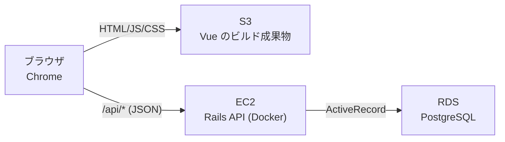

# 技術選定

[requirements.md](./requirements.md) の要件を満たすための技術構成と、その選定理由。
バージョンは着手時点での安定版を基準とし、実際の値は初期化時（[plan.md](./plan.md) のフェーズ1）に `Gemfile` / `package.json` で確定させる。

## 全体構成



フロントエンドとバックエンドを分離した構成とする。画面は S3 から静的配信し、データ操作は EC2 上の Rails API を経由して RDS に永続化する。

## 採用技術一覧

| 層 | 技術 | バージョン方針 |
| --- | --- | --- |
| バックエンド言語 | Ruby | 3.3 系 |
| バックエンドFW | Ruby on Rails（APIモード） | 8.x 系 |
| DBアクセス | ActiveRecord | Rails 同梱 |
| DBマイグレーション | ActiveRecord Migration | Rails 同梱 |
| APIレスポンス整形 | Jbuilder | 最新安定版 |
| CORS | rack-cors | 最新安定版 |
| テスト | RSpec Rails + FactoryBot | 最新安定版 |
| データベース | PostgreSQL | 16 |
| フロントエンド言語 | TypeScript | 5.x 系 |
| フロントエンドFW | Vue | 3 系（Composition API） |
| ビルドツール | Vite | 最新安定版 |
| HTTPクライアント | fetch（標準API） | - |
| ローカル実行 | Docker Compose | - |
| インフラ | Terraform + AWS（EC2 / RDS / S3） | Terraform 1.x 系 |

## 選定理由

### バックエンド: Ruby on Rails（APIモード）

本課題の目的のひとつが **これまで扱っていない言語を習得すること** であるため、Ruby を選んだ。Java のような静的型付け・明示的な記述とは対照的に、Ruby は動的型付けで記述量が少なく、Rails は「設定より規約」の思想を徹底している。設計の考え方そのものが異なるため、言語を変える意義が大きい。

Rails を選ぶ実務上の理由:

- ルーティング、バリデーション、DBアクセス、マイグレーション、テストが**フレームワークに最初から揃っている**。ライブラリの寄せ集めにならず、[features.md](./features.md) の 9 本の API を短い記述で実装できる
- `rescue_from` により、[エラーレスポンス](./features.md#エラーレスポンス)（400 / 404 / 500）の形式を 1 箇所で共通化できる
- マイグレーションが標準機能のため、[database.md](./database.md) のテーブル定義をバージョン管理でき、ローカルと RDS に同じ手順でスキーマを適用できる

**APIモード**（`rails new --api`）を選ぶのは、画面を Vue が持つため、ビューまわりの機能を読み込む必要がないから。起動が軽くなり、ミドルウェアの構成も理解しやすい。

### DBアクセス: ActiveRecord

Rails 標準であり、他の選択肢を積極的に採る理由がない。今回の要件との相性も良い。

**一括更新（[F-09](./features.md#f-09-一括更新)）が 1 文の UPDATE で書ける:**

```ruby
Entry.where(id: ids).update_all(category_id: category_id, updated_at: Time.current)
```

この更新を `transaction` で囲めば、「1 件でも対象外 ID があれば全件更新しない」という F-09 の受け入れ条件も素直に満たせる。

**月次の集計（[F-01](./features.md#f-01-月次サマリー), [F-03](./features.md#f-03-カテゴリ別集計)）** も、集計メソッドで短く書ける:

```ruby
Entry.joins(:category)
     .where(entry_date: range)
     .where(categories: { type: "EXPENSE" })
     .group(:category_id)
     .sum(:amount)
```

**動的な検索条件（[F-08](./features.md#f-08-検索絞り込み)）** も、スコープをつなぐだけで書ける:

```ruby
scope = Entry.includes(:category)
scope = scope.where(entry_date: from..) if from.present?
scope = scope.where(entry_date: ..to)   if to.present?
scope = scope.where(category_id:)       if category_id.present?
scope = scope.where("memo ILIKE ?", "%#{keyword}%") if keyword.present?
```

条件の有無で WHERE 句が変わる処理を、条件分岐をそのまま並べる形で表現できる。生成される SQL もプレースホルダ経由となり、requirements.md の SQL インジェクション対策を満たす。

なお `update_all` は**バリデーションと `updated_at` の自動更新をスキップする**ため、上記のように `updated_at` を明示的に指定し、更新値の妥当性はコントローラ側で検証する。この注意点は実装時に守る。

### データベース: PostgreSQL 16

課題の指定 DBMS。ローカルは Docker Compose、本番は RDS で同一メジャーバージョンを使い、環境差をなくす。
メモのキーワード検索（F-08）で、大文字小文字を区別しない部分一致に `ILIKE` をそのまま使える。

### フロントエンド: Vue 3 + TypeScript + Vite

React を避けつつ SPA を作る前提での選択。

- **日本語の情報が最も豊富**で、公式ドキュメントも日本語化されている。新しい言語（Ruby）と同時に学ぶ以上、フロント側で調べ物に時間を取られにくい方がよい
- コンポーネント・props・状態という**概念は React と共通**のため、これまでの経験が無駄にならない。一方でテンプレート構文やリアクティビティの仕組みは異なり、新しく学ぶ部分もある
- TypeScript により、[features.md のレコードJSON表現](./features.md#レコードの-json-表現)を型として定義し、API レスポンスの扱いミスを防ぐ
- Vite はビルド成果物が静的ファイルのため、そのまま S3 へ配置できる

状態管理ライブラリ（Pinia 等）は入れない。画面が 1 つで、共有する状態が「一覧・検索条件・選択中ID・モーダルの開閉」に限られるため、Composition API の `ref` / `computed` で足りる。

### 構成: API 分離型（Rails API + Vue の SPA）

Rails には Hotwire を使ったフルスタック構成もあるが、**手順2で作成した設計（JSON API・S3 静的配信・画面構成）をそのまま流用できる**ことを優先して、API 分離型を選んだ。設計の考え方を維持したまま、実装技術だけを入れ替える形になる。

### HTTPクライアント: 標準の fetch

使う API は 9 本だけで、axios のインターセプタ等の機能を必要としない。API 呼び出しは `src/api/` に薄いラッパ関数としてまとめ、エラーレスポンスの解釈をそこに集約する。

### テスト: RSpec + FactoryBot（リクエストスペック）

- Rails 標準は minitest だが、**実務では RSpec の採用率が高い**ため、学習の機会として RSpec を選ぶ
- `describe` / `context` / `it` の構造が、[features.md](./features.md) の受け入れ条件の書き方とそのまま対応する。受け入れ条件を 1 つずつ `it` に落とせる
- テスト対象は **API のリクエストスペック**とする。HTTP リクエストを投げてレスポンスと DB の状態を検証する形で、F-01〜F-09 の受け入れ条件を端から端まで確認できる
- フロントエンドは手動確認とする。新しい技術が多いため、テストの範囲を広げるより実装の完走を優先する

### ローカル実行: Docker Compose

PostgreSQL をコンテナで起動し、ローカルに DB を直接インストールせずに開発できる。起動手順は手順7で `start-servers` スキルとしてまとめる。

### インフラ: Terraform + EC2 / RDS / S3

| リソース | 用途 |
| --- | --- |
| S3（フロント用） | `vite build` の成果物を静的ウェブサイトとして配信 |
| S3（tfstate用） | Terraform の state 保管。他リソースより先に bootstrap として作る |
| EC2 | Rails API を Docker で実行。パブリックサブネットに配置 |
| RDS（PostgreSQL） | データ永続化。プライベートサブネットに配置し、EC2 のセキュリティグループからのみ接続を許可 |

課題の指定。構成をコード化することで、`terraform destroy` による確実な後片付けができる（[non-functional.md の N-17](./non-functional.md#保守性運用)）。
ECS や ALB は使わない。常時稼働・冗長化が要件外のため、単一 EC2 + Docker が最小構成として妥当。

## 採用しなかった選択肢

| 選択肢 | 不採用の理由 |
| --- | --- |
| Java + Spring Boot | 既習のため、新しい言語を学ぶという今回の目的に合わない |
| React | 同上 |
| Rails + Hotwire | Rails 公式の正攻法だが、JSON API を作らない構成のため、手順2で作成した features.md の API 仕様を丸ごと書き直すことになる。また複数選択（F-09）のクライアント状態管理を Stimulus で手書きすることになる |
| Inertia.js + Vue | API を作らずに Vue を使える中間案だが、日本語の情報が少なく、Ruby と Vue を同時に学ぶ今回は調べ物の負担が大きい |
| Svelte | 記述量は最小だが、日本語の情報が Vue より明らかに少ない |
| Sinatra | Ruby 言語自体に集中できるが、マイグレーション・バリデーション・テスト基盤を自分で用意することになり、AWS まで含む本課題では負担が大きい |
| minitest | Rails 標準だが、実務での露出は RSpec より少ない |
| vuedraggable / SortableJS | 当初はドラッグ&ドロップによる並び替えのために採用予定だったが、機能そのものを対象外としたため不要になった（[requirements.md の対象外](./requirements.md#22-対象外作らないもの)） |
| グラフ描画ライブラリ（Chart.js など） | カテゴリ別の内訳は、金額・割合・横棒バーを CSS で表現すれば把握できる。ライブラリの習得コストに見合わない |
| Pinia（状態管理） | 共有すべき状態が少なく、導入コストに見合わない |
| axios | fetch で足りる範囲しか使わない |
| ECS / Fargate + ALB | 学習用途の単一環境に対して構成要素が多く、コストも上がる |

## 命名の方針

**収支レコードのモデル名は `Entry`（テーブル名 `entries`）とする。** Rails では `record` が「DB の 1 行」を指す一般名詞として多用される（`ActiveRecord::RecordNotFound`、カスタムバリデータの `record` 引数など）ため、自作モデルを `Record` にすると自分のモデルの話か Rails の用語かの区別がつきにくく、エラー調査時にも検索しづらい。
日本語のドキュメント上の用語は「収支レコード」のまま維持する（[requirements.md の用語定義](./requirements.md#3-用語定義)）。

**API の JSON キーは snake_case** とする（`entry_date`、`category_id`、`year_month`）。Rails の属性名がそのまま JSON キーになるため、キー名の変換処理を書かずに済む。Vue 側も同じキー名で型定義する。

## 開発環境の前提

| 項目 | 内容 |
| --- | --- |
| OS | Windows 11（開発）、Amazon Linux 2023（本番 EC2） |
| 必要なツール | Ruby 3.3、Node.js 20 以上、Docker Desktop、Terraform 1.x、AWS CLI v2 |
| ローカルのポート | フロント `5173`（Vite）、API `3000`（Rails）、DB `5432`（PostgreSQL） |
| CORS | 開発時は Vite の proxy で `/api` を `3000` に転送し、CORS を発生させない。本番は S3 のドメインからの API 呼び出しになるため、`rack-cors` で許可オリジンを環境変数から設定する |

Windows 上で Ruby を直接動かすと gem のビルドでつまずくことがあるため、Rails も Docker コンテナで動かす方針とする（`docker-compose.yml` に `db` と `api` を定義する）。

## 設定値の扱い

DB の接続情報などの環境依存値は、ソースコードに直接書かず環境変数から読み込む（`DATABASE_URL`、`ALLOWED_ORIGINS`）。
Rails の `config/master.key`、RDS のパスワードを含む `.tfvars`、`.env` は Git にコミットしない（`.gitignore` に追加する）。
これは [non-functional.md の N-11](./non-functional.md#セキュリティ) に対応する。
